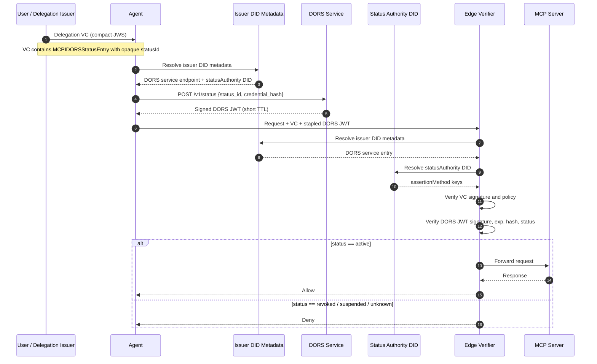

# DORS — Delegation Online Revocation Service

**Status:** Draft 0.2  
**Spec:** [SPEC.md](./SPEC.md)  
**Venue:** MCP-I extension / profile proposal

> A staplable, short-lived, signed status assertion for MCP-I delegation credentials — with a status authority that is cryptographically independent from the delegation-signing key.

---

## The Problem

MCP-I delegation credentials are signed by a `delegationKey`. Current MCP-I guidance points implementers toward `StatusList2021` or Bitstring Status List v1.0 for revocation.

That works under normal conditions. It breaks completely under one specific threat:

**What happens if the delegation-signing key is compromised?**

An attacker who obtains the `delegationKey` can:
1. Mint structurally valid, cryptographically correct forged delegation credentials.
2. Control the Bitstring Status List that verifiers consult — because the same key that signs credentials also controls the revocation list.

The revocation mechanism becomes useless precisely when it is needed most. The verifier has no independent path to invalidate trust.

This is the **Delegator Key Compromise bootstrapping paradox**: the revocation truth is anchored to the same key material that is under attack.

---

## What DORS Does

DORS introduces three things:

### 1. Independent status authority

A `statusAuthority` DID — distinct from the credential issuer DID — whose keys sign all DORS status assertions. Compromising the `delegationKey` does not grant control over this authority.

### 2. Trust anchor outside the credential

Verifiers discover the DORS endpoint and `statusAuthority` from **issuer DID metadata or local verifier policy**, not from fields embedded in the presented credential. A malicious credential cannot redirect verification to an attacker-controlled responder.

### 3. Per-credential hash binding

Every DORS status assertion is bound to the exact credential via a SHA-256 hash. A valid assertion cannot be replayed against a different credential.

---

## How It Works



The agent pre-fetches a DORS status assertion **before** connecting to the MCP server and staples it to the request. The Edge Verifier checks it without making an outbound call on the hot path.

---

## Quick Example

### Delegation credential (credentialStatus block)

```json
{
  "credentialStatus": [
    {
      "type": "BitstringStatusListEntry",
      "statusPurpose": "revocation",
      "statusListIndex": "482913",
      "statusListCredential": "https://issuer.example/status/revocation/3"
    },
    {
      "type": "MCPIDORSStatusEntry",
      "statusId": "urn:uuid:0d4e6d3a-1be3-4db1-b8d9-4f8c0d3f2031",
      "statusService": "did:web:issuer.example#dors"
    }
  ]
}
```

### DORS status query

```bash
curl -X POST https://status.issuer.example/v1/status \
  -H "Content-Type: application/json" \
  -H "Accept: application/jwt" \
  -d '{
    "status_id": "urn:uuid:0d4e6d3a-1be3-4db1-b8d9-4f8c0d3f2031",
    "credential_hash": "u_H0hL1AqfXhHQy50Yt7GmI2l5pTldm_5ewA9j0v3Ag",
    "credential_hash_alg": "sha-256"
  }'
```

### DORS JWT response (decoded payload)

```json
{
  "iss": "did:web:status.issuer.example",
  "sub": "urn:uuid:0d4e6d3a-1be3-4db1-b8d9-4f8c0d3f2031",
  "jti": "urn:uuid:eb42cb59-f789-4d74-bb2b-4d0fbb65d577",
  "iat": 1774782000,
  "exp": 1774782300,
  "credential_hash": "u_H0hL1AqfXhHQy50Yt7GmI2l5pTldm_5ewA9j0v3Ag",
  "credential_hash_alg": "sha-256",
  "status": "revoked",
  "reason": "key_compromise",
  "status_changed_at": 1774781940
}
```

The signed response uses `typ: mcpi-status+jwt` and is signed by a key in the `assertionMethod` of the `statusAuthority` DID — never by the delegation-signing key.

---

## Freshness Tiers (Proposed MCP-I Mapping)

| MCP-I Profile | Max DORS TTL | Stapling | Live lookup fallback |
|---|---|---|---|
| L1 — Personal / experimental | 24 hours | MAY | MAY |
| L2 — Internal SaaS / departmental agents | 1 hour | SHOULD | SHOULD |
| L3 — Enterprise / financial | **5 minutes** | MUST | MUST |

At L3, a 5-minute TTL means that even if the `delegationKey` is stolen, the blast radius is bounded. Cached assertions expire quickly, the next DORS fetch returns `revoked`, and forged credentials are stopped at the Edge Verifier.

---

## Deployment Topologies

**Self-hosted (L1/L2)**
Run the DORS responder as a separate process from the MCP server. Keep the status-signing key in a separate secret store. Simple to deploy; suitable for most development and departmental scenarios.

**Edge worker / serverless (L2/L3)**
Deploy the responder on Cloudflare Workers or equivalent. Status-signing key stays in platform secrets. State records in strongly consistent storage (Durable Objects or D1 — not KV). Resolves status assertions with sub-50ms latency for 95% of the globe.

**Enterprise IdP / HSM-backed (L3)**
Integrate the DORS endpoint into an existing enterprise IdP (Entra ID, Okta). Status-signing keys in HSM. Revocation actions go through incident response workflows. Supports bulk revocation by affected issuer key identifier.

---

## Repository Structure

```
dors/
├── SPEC.md                  # Full protocol specification (Draft 0.2)
├── src/
│   ├── types.ts             # Core interfaces and type definitions
│   ├── issuer.ts            # VC issuance with MCPIDORSStatusEntry injection
│   ├── responder.ts         # DORS responder — JWT generation and signing
│   └── verifier.ts          # Edge verifier logic
└── worker/
    └── index.ts             # Cloudflare Workers deployment
```

---

## Status and Roadmap

- [x] Protocol specification (Draft 0.2)
- [ ] TypeScript proof of concept
- [ ] GitHub Issue on `modelcontextprotocol-identity`
- [ ] Specification Enhancement Proposal (SEP)

---

## Relation to Bitstring Status List v1.0

DORS is **not** a replacement for Bitstring Status List. The two are complementary:

- Use **Bitstring Status List v1.0** for bulk, privacy-preserving baseline status publication.
- Use **DORS** when fast, per-credential, short-lived status assertions are needed — particularly for emergency key-compromise scenarios.

A credential MAY carry both `BitstringStatusListEntry` and `MCPIDORSStatusEntry`. Legacy deployments using only Bitstring Status List remain unaffected.

---

## Contributing and Open Questions

This is a draft protocol proposal targeting the MCP-I ecosystem. Community feedback is welcome, particularly on:

1. Should DORS be optional at L2 and mandatory at L3, or left entirely to trust frameworks?
2. Should `MCP-I-Status-Assertion` be standardised as a transport header in MCP-I core?
3. Should a future DORS profile define a Data Integrity binding alongside this JWT profile?
4. Should DORS be published as a standalone MCP-I extension or integrated into the core revocation section?
5. Should MCP-I specify that verifiers MUST evaluate both Bitstring Status List and DORS when both are present in a credential?

Open an issue or join the discussion in the MCP-I Discord.

---

## References

### Normative
- [MCP-I — Model Context Protocol Identity](https://www.modelcontextprotocol-identity.io/)
- [Verifiable Credentials Data Model v2.0](https://www.w3.org/TR/vc-data-model-2.0/)
- [Bitstring Status List v1.0](https://www.w3.org/TR/vc-bitstring-status-list/)
- [DID Core](https://www.w3.org/TR/did-core/)
- [RFC 6960 — OCSP](https://datatracker.ietf.org/doc/html/rfc6960)
- [RFC 2119 — Requirements Language](https://datatracker.ietf.org/doc/html/rfc2119)
- [RFC 8174 — Requirements Language Update](https://datatracker.ietf.org/doc/html/rfc8174)
- [OAuth Status Assertions (Internet-Draft)](https://datatracker.ietf.org/doc/html/draft-demarco-oauth-status-assertions)

### Informative
- [MCP-I FAQ](https://modelcontextprotocol-identity.io/faq)
- [MCP-I Edge Verification Guide](https://www.modelcontextprotocol-identity.io/docs/implementation/edge-verification-guide)
- [Agent Identity Protocol (AIP)](https://arxiv.org/html/2603.24775v1)
- [NIST SP 800-57 Part 3 Rev. 1 — Key Management](https://nvlpubs.nist.gov/nistpubs/specialpublications/nist.sp.800-57pt3r1.pdf)
- [Cloudflare Workers](https://workers.cloudflare.com/)
