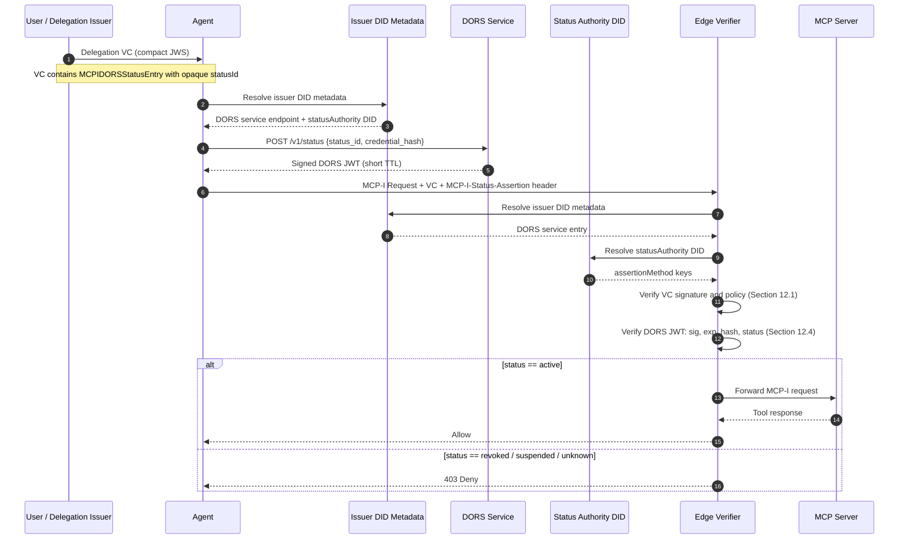

# DORS — Delegation Online Revocation Service

**Status:** Draft 0.1  
**Intended venue:** MCP-I extension / profile  
**Audience:** MCP-I implementers, verifier authors, identity architects

---

## Abstract

DORS defines a staplable, short-lived, signed status assertion for MCP-I delegation credentials.

The design goal is **not** to replace privacy-preserving status lists for bulk status publication. Instead, DORS adds an online status plane for **high-assurance** delegation — specifically for the case where the key that signs delegation credentials is compromised and revocation must take effect quickly.

This draft makes four opinionated choices:

1. The authority that signs DORS status assertions is **separate** from the authority that signs delegation credentials.
2. The DORS endpoint and status-signing authority are discovered from **issuer-controlled metadata or verifier policy**, not solely from fields embedded in the presented credential.
3. Status assertions are bound to the presented credential via a **credential hash**, so forged credentials cannot reuse a valid status response.
4. Agents SHOULD use **stapling-first** delivery to reduce privacy leakage and latency, with live lookup used only when needed.

This draft profiles DORS for **JWT-encoded delegation credentials**. A future version may define equivalent bindings for Data Integrity, SD-JWT VC, or COSE/CBOR encodings.

---

## 1. Scope

This specification defines:

- a new `credentialStatus` type: `MCPIDORSStatusEntry`
- a new DID `service` type: `MCPIDelegationRevocationService`
- an HTTP status query endpoint
- a signed JWT status assertion format
- verifier behavior for stapling, fallback, and conflict handling

This specification does **not** define:

- the administrative API for changing credential status
- trust registry semantics
- non-JWT credential encodings
- the full lifecycle of issuer DID rotation
- a replacement for Bitstring Status List v1.0

---

## 2. Requirements Language

The key words **MUST**, **MUST NOT**, **REQUIRED**, **SHOULD**, **SHOULD NOT**, **MAY**, and **OPTIONAL** in this document are to be interpreted as described in RFC 2119 and RFC 8174.

---

## 3. Problem Statement

Current MCP-I guidance requires revocation checking and points implementers toward `StatusList2021` or Bitstring Status List v1.0. That model is useful for bulk, privacy-preserving status publication. It leaves open a critical operational gap:

> What should a verifier do when the key that signed the delegation credential is compromised and revocation must propagate immediately?

If the same trust path both:
- signs delegation credentials, and
- defines or controls the revocation truth that the verifier consumes,

then compromise of that path allows an attacker to:
- mint new, structurally valid, cryptographically correct forged delegation credentials, and
- redirect or manipulate status metadata, because the verifier trusts credential-embedded status authority information.

The revocation mechanism becomes inoperative precisely when it is needed most. This is the **Delegator Key Compromise bootstrapping paradox**.

DORS addresses that gap by introducing an **independent, short-lived, staplable status assertion** signed by a key authority that is separate from the delegation-signing authority.

---

## 4. Design Goals

### 4.1 Goals

| Goal | Description |
|---|---|
| Independent status authority | A verifier can reject a delegation credential even if the delegation-signing key is compromised. |
| Trust anchor outside the VC | The endpoint and signing authority for status assertions are discovered from issuer metadata or verifier policy, not solely from the presented credential. |
| Per-credential freshness | A verifier can require a fresh status assertion with a short TTL. |
| Agent stapling | Agents can fetch and present status assertions ahead of time to avoid network calls on the hot path. |
| Forgery resistance | A valid status assertion cannot be replayed for a different credential because the response is bound to the credential hash. |
| Compatibility | DORS coexists with Bitstring Status List v1.0 or legacy status schemes. |

### 4.2 Non-goals

DORS is **not** intended to:

- replace Bitstring Status List for bulk, privacy-preserving publication
- solve request-level replay for MCP-I actions by itself
- define a central authority for all revocation
- require a third-party provider
- turn verifiers into online-only systems for every request

---

## 5. Threat Model and Trust Assumptions

### 5.1 Protected threat

DORS specifically targets the following attack scenario:

**Delegation Signing Key Compromise**

An attacker obtains the private key used to sign delegation credentials. The attacker can then issue malicious credentials that are structurally and cryptographically valid. Under the current Bitstring Status List model, the same compromised key also controls the revocation list, making revocation impossible to enforce.

### 5.2 Trust assumptions

DORS provides its intended protection only if the following hold:

1. The **status authority** is not controlled by the compromised delegation-signing key.
2. The metadata source used to discover DORS (issuer DID document, trust registry, or verifier policy) is **not mutable solely** by possession of the delegation-signing key.
3. The verifier is willing to **fail closed** when policy requires DORS and no valid status assertion is available.

### 5.3 Explicit limitation

If a deployment uses a static or non-updatable trust anchor, or a metadata model where the same compromised delegation-signing key can redefine the status authority, DORS **loses its key-compromise protection property**.

In that case DORS MAY still improve revocation freshness, but it MUST NOT be presented as a complete mitigation for delegation-key compromise.

---

## 6. Architecture Overview

DORS introduces three roles:

**Delegation Issuer**  
The entity that issues the MCP-I delegation credential.

**DORS Service**  
An HTTPS endpoint that answers status queries and returns signed status assertions.

**Status Authority DID**  
A DID, distinct from the issuer DID in the base profile, whose `assertionMethod` keys are authorized to sign DORS status assertions.

### 6.1 Key separation rule

In the **base DORS profile**, the `statusAuthority` DID **MUST be different** from the delegation credential `issuer` DID.

This separation ensures that:
- keys authorized to sign delegation credentials are distinct from keys authorized to sign status assertions, and
- a verifier can unambiguously determine which material is authorized for each purpose.

A future extension may define a same-DID profile with explicit key scoping, but that is out of scope for this draft.

### 6.2 Discovery rule

A verifier MUST obtain authoritative DORS metadata from one of:

1. **local verifier policy / trust registry**, or
2. the **issuer DID document**

If both are available, **local verifier policy takes precedence**.

Fields embedded in the presented credential MAY provide **hints** for selecting a service entry, but they MUST NOT override verifier policy or issuer-controlled metadata.

This rule is the primary defense against a compromised delegation key redirecting verification to an attacker-controlled responder.

---

## 7. Data Model

### 7.1 `credentialStatus` type: `MCPIDORSStatusEntry`

A delegation credential that supports DORS includes a `credentialStatus` entry of type `MCPIDORSStatusEntry`.

#### 7.1.1 Properties

| Property | Required | Type | Description |
|---|---|---|---|
| `type` | yes | string | MUST be `MCPIDORSStatusEntry` |
| `statusId` | yes | string | Opaque credential status identifier |
| `statusService` | no | string (DID URL) | Hint pointing to a DORS service entry in the issuer DID document |

#### 7.1.2 Semantics

- `statusId` MUST be unique per issued credential.
- `statusId` MUST be opaque to verifiers and SHOULD be randomly generated (e.g., a UUID v4).
- `statusId` MUST NOT encode issuance order, subject identity, or delegation scope in a way that leaks correlation-friendly metadata.
- `statusService`, if present, MUST be treated as a **hint only** until the verifier resolves it inside authoritative issuer metadata.

#### 7.1.3 Example

```json
{
  "credentialStatus": [
    {
      "type": "BitstringStatusListEntry",
      "statusPurpose": "revocation",
      "statusListIndex": "482913",
      "statusListCredential": "https://issuer.example/status/revocation/3"
    },
    {
      "type": "MCPIDORSStatusEntry",
      "statusId": "urn:uuid:0d4e6d3a-1be3-4db1-b8d9-4f8c0d3f2031",
      "statusService": "did:web:issuer.example#dors"
    }
  ]
}
```

The example above shows both `BitstringStatusListEntry` and `MCPIDORSStatusEntry` coexisting in the same credential. This is the recommended pattern for deployments that want both bulk privacy-preserving publication and fast per-credential revocation.

---

### 7.2 DID service type: `MCPIDelegationRevocationService`

The issuer DID document MAY advertise one or more DORS service entries.

#### 7.2.1 Properties

| Property | Required | Type | Description |
|---|---|---|---|
| `id` | yes | DID URL | Service identifier |
| `type` | yes | string | MUST be `MCPIDelegationRevocationService` |
| `serviceEndpoint` | yes | HTTPS URL | DORS query endpoint |
| `statusAuthority` | yes | DID | DID whose `assertionMethod` keys sign DORS assertions |
| `maxTtlSeconds` | no | integer | Advertised maximum TTL for DORS assertions |
| `formats` | no | array of string | Supported response formats; default is `["jwt"]` |

#### 7.2.2 Rules

- `serviceEndpoint` MUST be an `https://` URL.
- `statusAuthority` MUST identify a DID different from the credential issuer DID in the base profile.
- The `statusAuthority` DID document MUST contain at least one verification method authorized under `assertionMethod`.
- Only verification methods in the current `statusAuthority` DID document `assertionMethod` set are valid signers for DORS assertions.
- `maxTtlSeconds` is advisory. Verifiers MUST still apply their own local maximum freshness policy regardless of what the issuer advertises.

#### 7.2.3 Example: issuer DID document

```json
{
  "@context": ["https://www.w3.org/ns/did/v1"],
  "id": "did:web:issuer.example",
  "verificationMethod": [
    {
      "id": "did:web:issuer.example#delegation-key-1",
      "type": "JsonWebKey",
      "controller": "did:web:issuer.example",
      "publicKeyJwk": {
        "kty": "OKP",
        "crv": "Ed25519",
        "x": "<delegation-public-key>"
      }
    }
  ],
  "assertionMethod": [
    "did:web:issuer.example#delegation-key-1"
  ],
  "service": [
    {
      "id": "did:web:issuer.example#dors",
      "type": "MCPIDelegationRevocationService",
      "serviceEndpoint": "https://status.issuer.example/v1/status",
      "statusAuthority": "did:web:status.issuer.example",
      "maxTtlSeconds": 300,
      "formats": ["jwt"]
    }
  ]
}
```

#### 7.2.4 Example: status authority DID document

```json
{
  "@context": ["https://www.w3.org/ns/did/v1"],
  "id": "did:web:status.issuer.example",
  "verificationMethod": [
    {
      "id": "did:web:status.issuer.example#status-key-1",
      "type": "JsonWebKey",
      "controller": "did:web:status.issuer.example",
      "publicKeyJwk": {
        "kty": "OKP",
        "crv": "Ed25519",
        "x": "<status-public-key>"
      }
    }
  ],
  "assertionMethod": [
    "did:web:status.issuer.example#status-key-1"
  ]
}
```

The status authority DID document intentionally contains no service entries or delegation-related verification relationships. Its only function is to authorize status assertion signatures.

---

## 8. Issuance Binding Requirements

When an issuer creates a delegation credential containing `MCPIDORSStatusEntry`, it MUST create or update an issuance record that binds at minimum:

- issuer DID
- `statusId`
- `credential_hash`
- `credential_hash_alg`
- current status (`active`, `revoked`, or `suspended`)
- issuance timestamp
- status change history or equivalent latest-state metadata

The issuance record MUST allow the DORS service to determine whether the tuple `(statusId, credential_hash, credential_hash_alg)` corresponds to a credential that was actually issued by that issuer.

If the responder cannot confirm that the tuple corresponds to a known issued credential, it MUST return `status = "unknown"`. This prevents a forged credential from obtaining a valid `active` assertion by guessing a `statusId`.

### 8.1 Credential hash profile

This draft profiles **JWT-encoded** delegation credentials only.

- `credential_hash_alg` MUST be `sha-256`
- `credential_hash` MUST be computed over the exact ASCII bytes of the compact JWS string of the issuer-signed delegation credential
- the resulting digest MUST be encoded using unpadded base64url

Future versions MAY define canonicalization rules for other credential formats (Data Integrity, SD-JWT VC, COSE/CBOR).

---

## 9. HTTP Query Protocol

### 9.1 Endpoint

The DORS service endpoint is the `serviceEndpoint` value from the resolved `MCPIDelegationRevocationService` service entry in the issuer DID document or verifier policy.

The endpoint MUST support `POST`.

### 9.2 Request

#### 9.2.1 HTTP request

```
POST <serviceEndpoint>
Content-Type: application/json
Accept: application/jwt
```

#### 9.2.2 Request body

```json
{
  "status_id": "urn:uuid:0d4e6d3a-1be3-4db1-b8d9-4f8c0d3f2031",
  "credential_hash": "u_H0hL1AqfXhHQy50Yt7GmI2l5pTldm_5ewA9j0v3Ag",
  "credential_hash_alg": "sha-256",
  "nonce": "3sHC2p1b3L0m1n8z"
}
```

#### 9.2.3 Request field rules

| Field | Required | Description |
|---|---|---|
| `status_id` | yes | MUST equal the `statusId` value from `MCPIDORSStatusEntry` |
| `credential_hash` | yes | Base64url SHA-256 digest of the compact JWS credential |
| `credential_hash_alg` | yes | MUST be `sha-256` in this draft |
| `nonce` | no | Opaque string; if present, MUST be echoed in the signed response |

#### 9.2.4 Privacy rules

- The request MUST NOT require holder identity, subject identity, or verifier identity in the base profile.
- The service SHOULD be publicly readable for status lookups.
- Deployments that authenticate the caller SHOULD understand that authenticated lookup increases correlation risk.

### 9.3 Response behavior

For a syntactically valid request, the responder SHOULD return HTTP `200 OK` with a signed JWT, including when the resulting status is `unknown`.

Error HTTP status codes SHOULD be used only for:

| Code | Condition |
|---|---|
| `400` | Malformed request or unsupported hash algorithm |
| `503` | Temporary responder outage |

---

## 10. DORS Status Assertion (JWT)

A DORS response is a signed JWT carried as a compact JWS.

### 10.1 JOSE header

| Field | Required | Description |
|---|---|---|
| `alg` | yes | Signature algorithm; MUST NOT be `none`. `EdDSA` (Ed25519) is RECOMMENDED. |
| `kid` | yes | Verification method ID in the `statusAuthority` DID document `assertionMethod` set |
| `typ` | yes | MUST be `mcpi-status+jwt` |

Example:

```json
{
  "alg": "EdDSA",
  "kid": "did:web:status.issuer.example#status-key-1",
  "typ": "mcpi-status+jwt"
}
```

### 10.2 JWT claims

| Claim | Required | Type | Description |
|---|---|---|---|
| `iss` | yes | string | MUST equal the `statusAuthority` DID |
| `sub` | yes | string | MUST equal the queried `status_id` |
| `jti` | yes | string | Unique response identifier (UUID v4 RECOMMENDED) |
| `iat` | yes | NumericDate | Issued-at time |
| `exp` | yes | NumericDate | Expiration time |
| `credential_hash` | yes | string | Base64url digest of the queried credential |
| `credential_hash_alg` | yes | string | MUST be `sha-256` in this draft |
| `status` | yes | string | One of `active`, `revoked`, `suspended`, `unknown` |
| `reason` | no | string | Optional reason code (see Section 10.4) |
| `status_changed_at` | no | NumericDate | Time of last status transition |
| `nonce` | no | string | Echo of request nonce, if supplied |

### 10.3 Status semantics

**`active`**  
The responder recognizes the credential as issued and not currently revoked or suspended. `active` does not replace verification of credential signature, issuer trust, expiry, scope, or delegation chain validity.

**`revoked`**  
The responder recognizes the credential as issued and permanently revoked. A `revoked` credential MUST NOT return to `active`.

**`suspended`**  
The responder recognizes the credential as issued and temporarily not acceptable. A `suspended` credential MAY return to `active` if local policy allows that lifecycle transition.

**`unknown`**  
The responder cannot confirm that the queried `(status_id, credential_hash, credential_hash_alg)` tuple corresponds to an issued credential, or cannot assert an acceptable state for that tuple. Verifiers MUST reject `unknown` unless local policy explicitly defines an interoperability fallback.

### 10.4 Reason codes

If `reason` is present, implementations SHOULD use one of the following registry values for public interoperability:

| Value | Description |
|---|---|
| `key_compromise` | The delegation-signing key was compromised |
| `privilege_withdrawn` | The delegation was explicitly withdrawn |
| `superseded` | A replacement credential has been issued |
| `administrative_suspend` | Temporarily suspended by an administrator |
| `cessation_of_operation` | The delegating entity has ceased operating |
| `unspecified` | No specific reason is provided |

Implementations MAY use private reason codes prefixed with `x-`.

### 10.5 Example response payload

```json
{
  "iss": "did:web:status.issuer.example",
  "sub": "urn:uuid:0d4e6d3a-1be3-4db1-b8d9-4f8c0d3f2031",
  "jti": "urn:uuid:eb42cb59-f789-4d74-bb2b-4d0fbb65d577",
  "iat": 1774782000,
  "exp": 1774782300,
  "credential_hash": "u_H0hL1AqfXhHQy50Yt7GmI2l5pTldm_5ewA9j0v3Ag",
  "credential_hash_alg": "sha-256",
  "status": "revoked",
  "reason": "key_compromise",
  "status_changed_at": 1774781940
}
```

---

## 11. Stapling

### 11.1 Agent behavior

An MCP-I agent SHOULD prefetch a DORS status assertion before connecting to an MCP server and attach it when presenting a delegation credential.

When transported over HTTP in an MCP-I request, the agent SHOULD send the compact JWT in the following header:

```
MCP-I-Status-Assertion: <compact-jwt>
```

Other transports MAY carry the same JWT in an equivalent envelope field.

The prefetch SHOULD occur asynchronously, outside the blocking path of the model's reasoning loop, to minimize added latency.

### 11.2 Verifier behavior

If a verifier receives a valid, fresh stapled DORS assertion:

- it SHOULD use the stapled assertion
- it SHOULD NOT perform a live DORS lookup for the same request, unless local policy requires revalidation

If the stapled assertion is missing, expired, invalid, or exceeds local freshness policy, the verifier MAY perform a live DORS lookup.

For high-assurance profiles (L3), inability to obtain or validate a required DORS assertion MUST be treated as a hard failure.

---

## 12. Verification Algorithm

Given a presented delegation credential `C`, an optional stapled DORS assertion `A`, and local verifier policy `P`, the verifier performs the following steps.

### 12.1 Credential verification

The verifier MUST first validate `C` according to MCP-I and the applicable VC profile, including:

- credential signature
- issuer resolution and trust
- validity period
- scope and delegation semantics
- any required delegation chain validation

DORS does not replace or shortcut these checks.

### 12.2 DORS discovery

If `C` contains `MCPIDORSStatusEntry`, the verifier MUST discover authoritative DORS service metadata as follows:

1. Check local verifier policy or trust registry.
2. Otherwise, resolve the issuer DID document and locate a service entry of type `MCPIDelegationRevocationService`.
3. If `statusService` is present in the credential, the verifier MAY use it as a hint to select the matching service entry **only if** that entry is confirmed in authoritative metadata.
4. If no authoritative DORS metadata is found, verifier behavior is determined by local policy.

### 12.3 Compute credential hash

```
credential_hash_alg = "sha-256"
credential_hash = base64url( SHA-256( ASCII( compact_jws_of_C ) ) )
```

### 12.4 Validate stapled assertion

If a stapled assertion `A` is present, the verifier MUST check:

1. `typ == "mcpi-status+jwt"`
2. JWS signature validates using a key in the `assertionMethod` of the resolved `statusAuthority` DID
3. `iss == statusAuthority`
4. `sub == statusId`
5. `credential_hash_alg == "sha-256"`
6. `credential_hash` equals the locally computed hash of `C`
7. `now < exp`
8. `iat <= now + allowed_clock_skew` (60 seconds RECOMMENDED)
9. `(exp - iat) <= P.max_dors_ttl_seconds`

If any check fails, the stapled assertion MUST be rejected and the verifier MUST NOT proceed as if a valid assertion is present.

### 12.5 Live lookup

If no acceptable stapled assertion is available and policy permits live lookup, the verifier MUST POST a DORS request containing `status_id`, `credential_hash`, `credential_hash_alg`, and an optional `nonce`.

The verifier MUST validate the returned JWT using the same rules as in Section 12.4.

If a `nonce` was sent in the request, the signed response MUST contain the matching `nonce`. A response with a missing or mismatched `nonce` MUST be rejected.

### 12.6 Status decision

After obtaining a valid DORS assertion, the verifier MUST apply:

| Status | Action |
|---|---|
| `active` | Continue; proceed with request |
| `revoked` | Reject |
| `suspended` | Reject |
| `unknown` | Reject, unless local policy defines an explicit interoperability fallback |

### 12.7 Coexistence with other status mechanisms

If the credential contains both DORS and another status mechanism (e.g., Bitstring Status List):

- the verifier SHOULD evaluate both
- any mechanism that yields a non-acceptable result MUST cause rejection
- local policy MAY define additional conflict remediation, but the safe default is **fail closed**

---

## 13. Freshness and Proposed MCP-I Conformance Mapping

The following table is a proposed mapping for MCP-I conformance level discussions.

| MCP-I Profile | Max accepted DORS TTL | Stapling | Live lookup fallback |
|---|---|---|---|
| L1 — Personal / experimental | 24 hours | MAY | MAY |
| L2 — Internal SaaS / departmental agents | 1 hour | SHOULD | SHOULD |
| L3 — Enterprise / financial | 5 minutes | MUST | MUST |

### 13.1 Rules

- A verifier MUST reject a DORS assertion whose `(exp - iat)` lifetime exceeds local policy, even if the issuer advertises a larger `maxTtlSeconds`.
- A responder MAY issue shorter-lived assertions than the profile maximum.
- Verifiers SHOULD allow a small clock skew. 60 seconds is RECOMMENDED.

At L3, a 5-minute TTL means that even when the `delegationKey` is compromised, the maximum window during which a forged credential with a cached `active` assertion can be accepted is bounded and predictable.

---

## 14. Operational State Changes

The administrative protocol for changing DORS state is out of scope for this specification. The following normative requirements apply to any conformant implementation:

- Only authorized status operators MAY change a credential from `active` to `revoked` or `suspended`.
- A `revoked` credential MUST NOT return to `active`.
- A `suspended` credential MAY return to `active` if local policy explicitly allows that lifecycle transition.
- Status changes SHOULD be durably recorded in an audit log or equivalent tamper-evident store.
- Emergency procedures SHOULD support **bulk revocation** of all credentials associated with an affected issuer key identifier, to contain the blast radius of a key-compromise event.

---

## 15. Security Considerations

### 15.1 Trust anchor independence is the critical property

The most important security property in DORS is that the verifier does **not** trust the presented credential alone to determine which status authority to consult.

If a malicious credential can redefine the DORS endpoint or the status-signing key, DORS fails to protect against delegation-key compromise. Implementations MUST ensure that their metadata discovery path (Section 6.2) cannot be overridden by credential-embedded fields alone.

### 15.2 Response replay within the TTL window

DORS reduces revocation latency but does not eliminate replay inside the assertion lifetime. A captured `active` assertion may be replayed until `exp`.

Mitigations:
- Keep TTLs short (see Section 13).
- MCP-I write operations SHOULD use request-level nonce or anti-replay protections independently of DORS.
- Verifiers MAY track recently seen `jti` values to detect within-window replay, but `jti` alone is not a complete anti-replay mechanism.

### 15.3 Forged credentials

A forged credential MUST NOT be accepted because a status responder returns `active` for a `statusId`.

This draft prevents that failure by:
- requiring a credential hash in the query,
- requiring the same credential hash in the signed response, and
- mandating `unknown` when the `(statusId, credential_hash)` tuple is not recognized as issued.

An attacker who guesses or reuses a `statusId` from a legitimate credential will be blocked because the hash of the forged credential will not match the hash bound in the DORS record.

### 15.4 Privacy

Because DORS is per-credential, direct online lookups can leak presentation patterns to the DORS responder.

Implementations SHOULD:
- prefer stapled assertions to avoid live lookups
- avoid live lookup when a fresh staple is available
- use an issuer-approved privacy proxy when unlinkability is a requirement
- minimize query logging
- avoid including holder identity in requests or responses

### 15.5 Availability and fail-closed behavior

A DORS responder outage can become an authorization outage if policy requires fresh status assertions.

Deployments SHOULD:
- run DORS on highly available infrastructure
- support stapling to reduce hot-path dependency on the responder
- explicitly define whether a missing or unavailable DORS response is a hard or soft failure at each assurance level

The RECOMMENDED default for L3 is **fail closed**: if a required DORS assertion cannot be obtained or validated, the request MUST be denied.

### 15.6 Key isolation

The private keys used by the delegation issuer and by the DORS status authority SHOULD be isolated operationally and cryptographically.

Best practice:
- separate processes
- separate secret storage or hardware security domains (HSM or equivalent)
- no shared memory space between the delegation-signing and status-signing environments

### 15.7 Static trust anchors

If a deployment uses a DID method or metadata arrangement where the same compromised delegation-signing key can redefine the status authority, DORS MUST be treated as a latency improvement only. It MUST NOT be presented as a key-compromise mitigation in that configuration.

---

## 16. Privacy Guidance

DORS is intentionally not a full replacement for Bitstring Status List v1.0. The recommended usage pattern is:

- Use **Bitstring Status List v1.0** for bulk, privacy-preserving baseline status publication.
- Use **DORS** when fast, per-credential, short-lived status assertions are needed — particularly for emergency revocation under delegation-key compromise.
- **Staple DORS assertions** whenever possible to prevent per-presentation linkability.

This mixed model lets implementers retain the herd-privacy properties of bitstring-based status while gaining a fast, independent emergency status channel for MCP-I delegation.

---

## 17. Backward Compatibility

DORS is strictly additive.

A credential MAY contain:
- only `BitstringStatusListEntry`
- only `MCPIDORSStatusEntry`
- both

Legacy `StatusList2021` deployments remain processable according to local policy. New deployments SHOULD prefer Bitstring Status List v1.0 where a privacy-preserving bulk status list is needed.

No existing MCP-I credential format needs to change for DORS to be introduced.

---

## 18. Deployment Guidance (Non-normative)

### 18.1 Self-hosted (L1 / L2)

Suitable for prototyping and departmental deployments.

Recommendations:
- Run the DORS responder as a **separate process** from the MCP server.
- Do not reuse the delegation-signing secret for status assertion signing.
- Store status-signing keys separately from delegation-signing keys.
- Restrict administrative revocation endpoints to authorized operators.

Limitation: without physical isolation, a full server compromise may expose both key types simultaneously. Self-hosted is not recommended for L3.

### 18.2 Edge worker / isolated serverless (L2 / L3)

Good default for high-throughput, geographically distributed deployments.

Recommendations:
- Keep the DORS status-signing key in platform secrets (e.g., Cloudflare Workers secrets) or HSM-backed storage.
- Store issuance and state records in **strongly consistent** storage (e.g., Durable Objects or equivalent). Eventually consistent KV stores are not suitable for L3.
- Terminate TLS at the edge close to the verifier population.

This topology provides the best latency profile (sub-50ms for most of the globe) and the strongest key isolation without requiring on-premises HSM infrastructure.

### 18.3 Enterprise IdP / HSM-backed authority (L3)

Best fit for high-assurance, regulated environments.

Recommendations:
- Keep status-signing keys in a hardware security module (HSM).
- Integrate revocation actions with incident response workflows and admin approval chains.
- Support bulk revocation by affected issuer key identifier.
- Emit status change events to a SIEM or equivalent audit system, particularly for `reason: key_compromise`.

---

## 19. Suggested Registry Entries

This specification proposes the following identifiers for MCP-I ecosystem registration:

| Type | Name | Notes |
|---|---|---|
| `credentialStatus` type | `MCPIDORSStatusEntry` | Section 7.1 |
| DID service type | `MCPIDelegationRevocationService` | Section 7.2 |
| HTTP header | `MCP-I-Status-Assertion` | Value: compact JWT |
| JOSE `typ` | `mcpi-status+jwt` | Section 10.1 |

---

## 20. End-to-End Flow



---

## 21. Open Questions for Community Review

1. Should MCP-I make DORS optional at L2 and mandatory at L3, or leave that entirely to trust frameworks?
2. Should MCP-I standardize `MCP-I-Status-Assertion` as a transport header in core, or leave transport binding out of scope?
3. Should a future DORS draft define a Data Integrity binding in addition to this JWT profile?
4. Should DORS be published as a standalone MCP-I extension, or integrated directly into the core revocation section of MCP-I documentation?
5. Should MCP-I specify that verifiers MUST evaluate both Bitstring Status List and DORS when both are present in a credential?

---

## 22. Summary

DORS provides effective protection against delegation-key compromise in MCP-I **if and only if**:

- the status authority DID is independent from the delegation-signing authority
- the verifier discovers that authority from metadata outside the presented credential
- the signed response is cryptographically bound to the exact credential via a hash
- `unknown` is returned for unrecognized or mismatched credential tuples
- stapling-first behavior is the norm, protecting privacy and reducing hot-path latency

Without these properties, DORS is a faster revocation lookup. With them, it becomes a credible, independently auditable extension for high-assurance MCP-I delegation.

---

## 23. References

### Normative

- Model Context Protocol – Identity: https://www.modelcontextprotocol-identity.io/
- Verifiable Credentials Data Model v2.0: https://www.w3.org/TR/vc-data-model-2.0/
- Bitstring Status List v1.0: https://www.w3.org/TR/vc-bitstring-status-list/
- Decentralized Identifiers (DID Core): https://www.w3.org/TR/did-core/
- RFC 6960 (OCSP): https://datatracker.ietf.org/doc/html/rfc6960
- RFC 2119 (Requirements Language): https://datatracker.ietf.org/doc/html/rfc2119
- RFC 8174 (Requirements Language Update): https://datatracker.ietf.org/doc/html/rfc8174
- OAuth Status Assertions (Internet-Draft): https://datatracker.ietf.org/doc/html/draft-demarco-oauth-status-assertions

### Informative

- MCP-I FAQ: https://modelcontextprotocol-identity.io/faq
- MCP-I Edge Verification Guide: https://www.modelcontextprotocol-identity.io/docs/implementation/edge-verification-guide
- Agent Identity Protocol (AIP): https://arxiv.org/html/2603.24775v1
- NIST SP 800-57 Part 3 Rev. 1 (Key Management): https://nvlpubs.nist.gov/nistpubs/specialpublications/nist.sp.800-57pt3r1.pdf
- Cloudflare Workers: https://workers.cloudflare.com/
